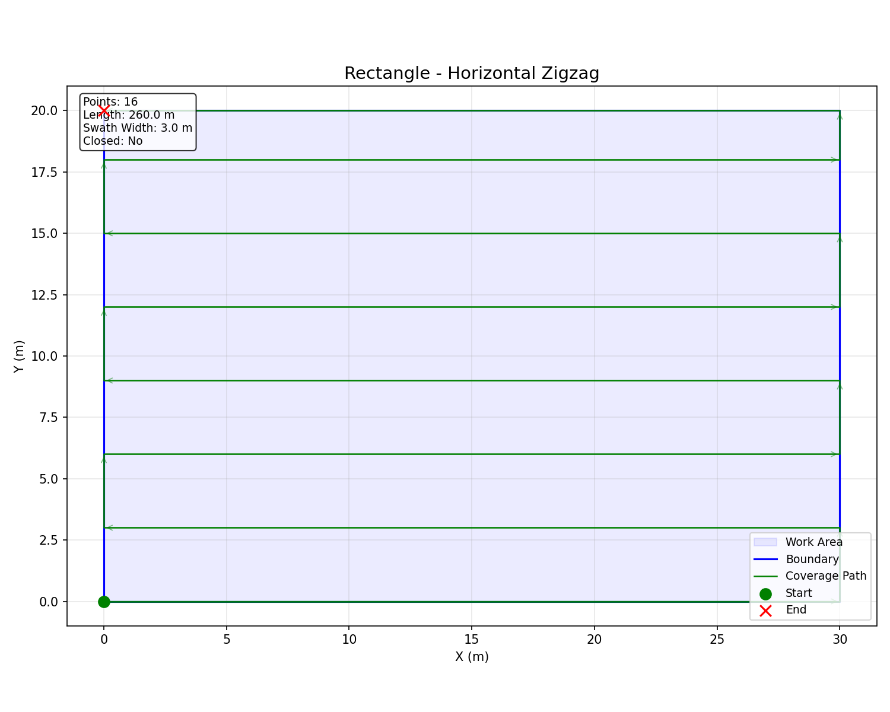
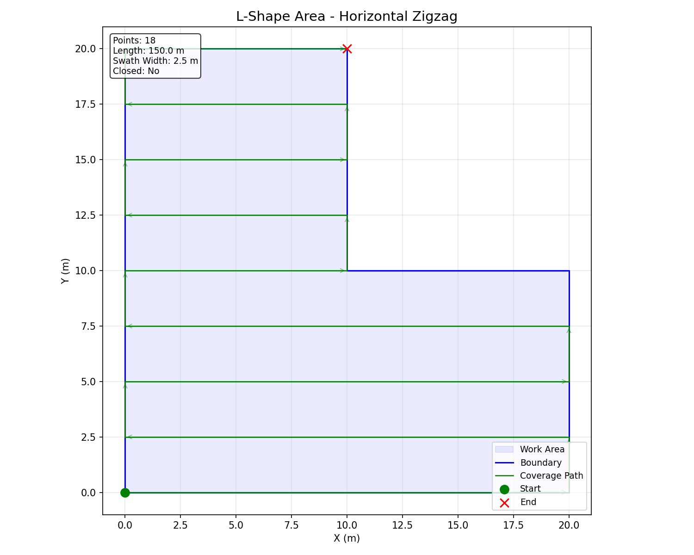
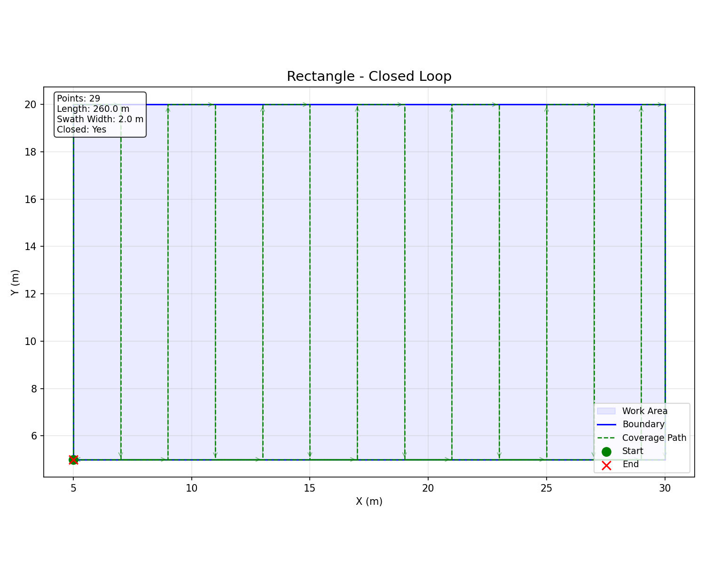

# SweeperCover 🧹

> 自动全覆盖路径规划工具 — 专为无人驾驶环卫车、扫地车等场景设计

在你的电脑或 Ubuntu 设备上运行，加载卫星地图，画出作业区域和障碍物，
自动生成兼顾障碍物避让的弓字形全覆盖路径，支持闭环循环作业。

## 快速开始

```bash
# 启动可视化编辑器
python3 run.py

# 或使用命令行模式
python3 run.py --cli

# 运行演示（生成示例截图）
python3 run.py --demo
```

**使用流程 —— 四步搞定：**

```
1. 加载地图       → 导入卫星图/现场照片
2. 画作业区域     → 鼠标点出边界（右键完成）
3. 画障碍物       → 画出树池、花坛、石柱等
4. 设定比例尺     → 画参考线，输入实际米数
→ 生成路径        → 自动避障全覆盖路径
→ 导出路径        → 保存为坐标文件
```

## 功能特性

- ✅ **加载地图底图** — 卫星图、现场照片、CAD 截图
- ✅ **绘制作业区域** — 鼠标点出任意多边形边界
- ✅ **绘制障碍物** — 树池、花坛、路灯、石柱，想画几个画几个
- ✅ **比例尺设定** — 画参考线 → 输入实际距离，自动换算
- ✅ **全覆盖路径生成** — zigzag 弓字形，自动绕过障碍物
- ✅ **闭环路径** — 终点回起点，适合循环作业
- ✅ **路径导出** — 文本格式坐标文件
- ✅ **可视化** — 路径实时显示在地图上
- ✅ **平移/缩放** — 滚轮缩放，拖拽平移

## 示例效果

| 矩形区域 | L形区域 | 带障碍物 |
|---------|---------|---------|
|  |  |  |

## 项目结构

```
sweeper-cover/
├── sweeper_cover/          ← 核心算法库
│   ├── coverage.py         ← 全覆盖路径生成（支持障碍物避让）
│   ├── visualize.py        ← matplotlib 可视化
│   └── gui.py              ← PyQt5 可视化编辑器
├── examples/demo.py        ← 演示脚本
├── run.py                  ← 启动入口（GUI/CLI/演示）
├── README.md
├── LICENSE                 ← MIT 开源许可证
└── .gitignore
```

## 依赖

- Python 3.8+
- PyQt5 — 图形界面
- matplotlib — 可视化（CLI 模式用）

## 安装

```bash
# 在 Ubuntu 上安装依赖
sudo apt install python3-pyqt5
pip install matplotlib

# 启动
python3 run.py
```

## 许可证

MIT License — 随意使用、修改、分发。
